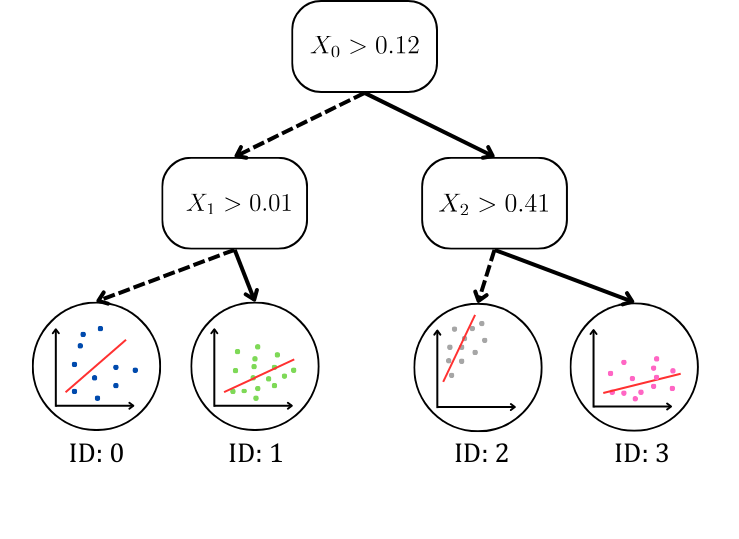

# Hybrid Learning Model (Decision Tree + Linear Regression)

### A hybrid implementation of Scikit's Decision Tree and Linear Regressors intended to predict delays in digital integrated circuits. 

This project was developed as a graduation project for the class IE-0499 at the Universidad de Costa Rica, on behalf of the  [Microelectronics and Computer Architecture Research Lab (LIMA)](https://eie.ucr.ac.cr/laboratorios/lima/). The purpose of this implementation is to combine two widely known machine learning techniques—decision trees and linear 
regression—to create a fast and lightweight model for predicting net delays in integrated circuits.

This project heavily relies on the open source, RTL-to-GDSII tool [OpenLane](https://github.com/The-OpenROAD-Project/OpenLane), and it aims to improve its pre-routing delay approximations.

## Table of Contents

1. [Installation](#installation)
2.  [Usage](#usage)
3.  [Dataset](#dataset)
4.  [Model](#model)
5.  [Evaluation](#evaluation)


## Installation

Create a python virtual enviroment and install the dependencies on `requirements.txt`
```
python -m venv .venv
source bin/activate
pip install requirements.txt -r
```

## Usage

Access the model similarly as you would a DecisionTreeRegressor() model from Scikit-Learn.

```python
from src.model.hybridmodel import HybridModel

# pass decision tree hyperparameters to the HybridModel class
hb_model = HybridModel(max_depth=9,
                       max_features=15,
                       random_state=10)

hb_model.fit(X_train, y_train)  # train with fit() method

y_pred = hb_model.predict(X_test)  # predict with predict() method
```

Some of the hyperparameters of the decision tree are
```python
"""
tree params={'ccp_alpha': 0.0, 'criterion': 'squared_error', 'max_depth': None, 'max_features': None, 'max_leaf_nodes': 
None, 'min_impurity_decrease': 0.0, 'min_samples_leaf': 1, 'min_samples_split': 2, 'min_weight_fraction_leaf': 0.0, 
'random_state': None, 'splitter': 'best'}
"""
```

### Data Preprocessing

This class implements a way to access and modify training and testing datasets quickly. It's a wrapper for functions like
* Loading existing datasets from the `\datasets` directory with the `load_data` method.
* Perform feature engineering
* Filtering samples to perform tests on specific circuits   
* Transistor corner selection (fast or slow)
* Feature scaling (standard scaler, min max scaler)
* Save the modified datasets into a `.csv`

A generic use might be
```python
from src.preprocessing import Preprocessing
# create instance of the class with specific parameters
pre = Preprocessing(verbose=2, 
                    remove_nan=True,
                    corner='slow',
                    feature_scaling='standard',
                    context_features=False,
                    std_dvt_context=False,
                    distance_parameter=True,
                    )
# load existing datasets to be preprocessed 
pre.load_data(["../datasets/processed/slow.csv",
               "../datasets/processed/designs_slow.csv",
               "../datasets/processed/labels_slow.csv"])

# save preprocessed datasets if desired
pre.to_csv(file_names=['small_slow_train.csv', 
                       "small_slow_labels_test.csv", 
                       "test_labels.csv"])

# access datasets as variables  
train_data, test_data1, test_data2 = pre.get_data()
```

#### Parameters
* `corner`: (str), values `fast`, `slow`. Selects the samples based on the `Label Delay` parameter. `fast` gets the results with the lowest Label Delay value. `slow` get the highest ones.
* `feature_scaling`: (str), values `standard`, `minmax`. Selects the feature scaling to be performed on the training and testing sets. Note, if using this parameter, make sure the training set goes first in the `load_data` method, such as `load_data(["train.csv", "test.csv"])`
* `context_features`: (bool). Whether the features related to the context of the circuit are to be included in the datasets to be processed.
* `std_dvt_context`: (bool). Whether the features related to the standard deviation of the context of the circuit are to be included in the datasets to be processed.
* `distance_parameter`: (bool). Whether the X and Y locations of the driver and sink gates are to be replaced with a single parameter with the distance between each other. 
* `remove_nan`: (bool). Whether NaNs values are to be replaced or not.
* `test_design_name`: (str). Deletes all other samples where the design name does not match that one of the `design_name`. If using this parameter, make sure that the design name does exist in all testing datasets (the training set - or the first set in load_data, doesn't have to include it)
* `verbose`: (int), values 0, 1, 2. Controls the output of text in the terminal, where 0 is nothing and 2 is the maximum. 

## Dataset

Samples were obtained from OpenLane's signoff results on multiple benchmark circuits with different design parameters
and optimizations, including clock frequency, die utilization, among others. The following image 
illustrates the relationship between the three datasets utilized. 


<div align="center">
  
  <br>
</div>


<details>
  <summary style="font-size: 20px; font-weight: bold;"> Features </summary>

* `Fanout: ` The number of gate inputs driven by a single gate’s output
* `Slew: ` The signal transition time from states
* `Delay: ` OpenLane's result on the interconnect delay
* `Distance: ` Euclidean distance from the driving to the source gate
* `C_drive: ` Capacitance of the driving gate
* `C_sink: ` Capacitance of the sink gate
* `X_context: ` Average location of the X axis of the context sinks
* `Y_context: ` Average location of the Y axis of the context sinks
* `σ(X)_context: ` Standard deviation of the X axis of the context sinks
* `σ(Y)_context: ` Standard deviation of the Y axis of the context sinks
* `Drive_cell_size: ` Size of the drive gate
* `Sink_cell_size: ` Size of the sink gate
* `Label Delay: ` Signoff delay results. Target variable

</details>

For the best results, context parameters are not included. 

## Model

### Training

First, a decision tree is fitted. Each sample is grouped by the leaf node they are classified in, using the `apply` 
method from Scikit's DecisionTreeRegressor. A linear regression is then fitted with the grouped samples. Hence, there is
a linear regression for each leaf node in the tree. 

<div align="center">
  
  <br>
</div>

### Predicting

The decision tree will classifiy the sample in a leaf node. A linear regression is performed on the testing sample, 
with the previosly fitted coefficients. 


